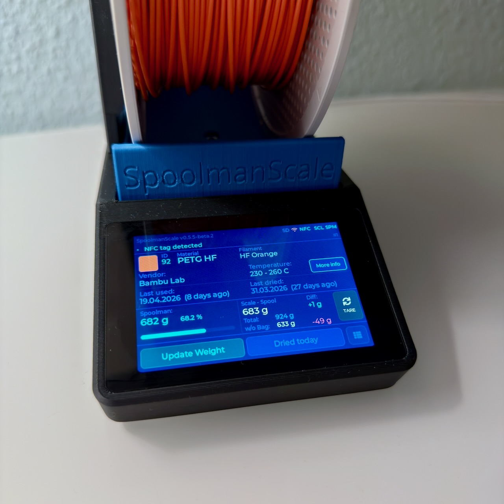
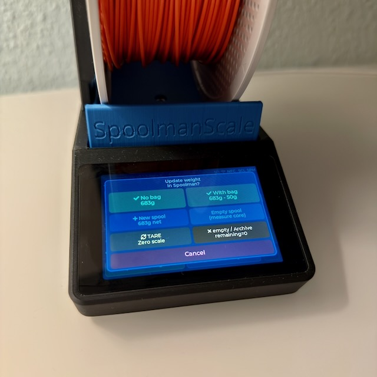
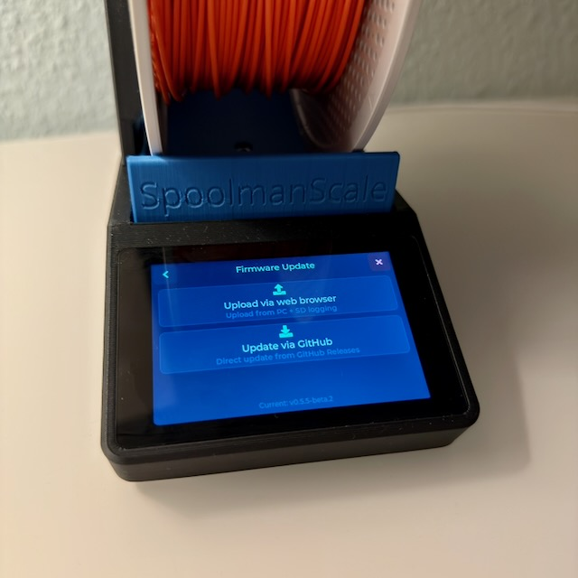
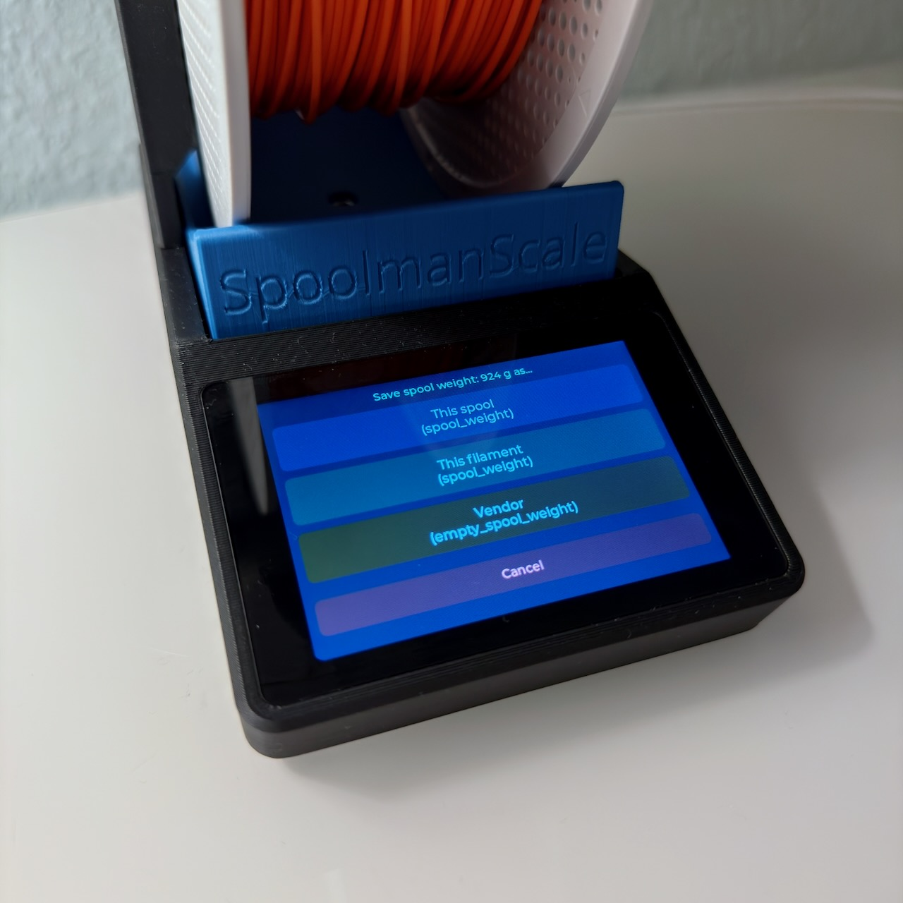

<picture>
  <source media="(prefers-color-scheme: light)" srcset="images/logo_1.jpeg">
  <source media="(prefers-color-scheme: dark)" srcset="images/logo_2.jpeg">
  
</picture>

# SpoolmanScale

> 🚀 **Public Beta** – This is beta software, provided as-is. Expect bugs, rough edges, and missing documentation. Use at your own risk.

**SpoolmanScale** is an open-source ESP32-based filament scale with NFC reader, integrating directly with [Spoolman](https://github.com/Donkie/Spoolman).

Yes, another filament scale – but hear me out, this one might actually earn a spot next to your printer. 😄

Place a spool on the scale – it reads the NFC tag, pulls the spool data from Spoolman, and lets you update the remaining weight, log a drying date, or archive empty spools. All from a 3.5" touchscreen. No phone needed.

> A running [Spoolman](https://github.com/Donkie/Spoolman) instance on your local network is required – this is what stores all your spool data.

---

## Status

🎉 **Public Beta is live!** Firmware is released and available via the [Web Flasher](https://niko11111.github.io/SpoolmanScale) or as a direct download from [Releases](https://github.com/Niko11111/SpoolmanScale/releases).

> **Please note:** This is a beta release. A more detailed guide is in the works, but this README already covers all the essential steps to get your SpoolmanScale up and running. If you run into issues, join the [Discord](https://discord.gg/GzQzGa5pBG) – happy to help.

Currently tested with a Spoolman library of 260+ active spools and running stable. If you have an even larger collection – I'd love to hear how it holds up!

---

 

  
  
 

---

## Features

* 🏷️ **Bambu Lab NFC tags** – place a spool on the scale and SpoolmanScale reads it instantly: material, color, vendor, remaining weight and drying history appear automatically. No tapping required
* 🔗 **Bambu Lab spool linking** – first time using a spool? SpoolmanScale finds the matching entry in Spoolman automatically by filtering unlinked spools by material type, subtype (e.g. HF, CF, Matte) and color similarity — so you only see spools that actually match your tag
* 🔗 **Third-party spool linking** – place any NTAG sticker → select vendor and material → pick from a filtered list → linked in Spoolman via `extra.tag`
* 📋 **Copy spool** – running low? Place a new spool on the scale, tap Copy spool, and SpoolmanScale creates an identical entry in Spoolman, tags the NFC chip, and logs the current weight — all in one step
* ⚖️ **Live weight (NAU7802)** – moving average filter, TARE, live diff vs. Spoolman remaining weight
* 📡 **Spoolman REST API** – update remaining weight, set initial weight, set spool weight (per spool / filament / vendor), log drying date, archive spools
* 📱 **Touchscreen UI (LVGL 8.3, 480×320)** – settings menu, confirmation popups, sleep/wake, no-tag timer
* ⚙️ **On-device Wi-Fi setup** – scan networks, enter credentials and Spoolman IP directly on the touchscreen
* 🔄 **Firmware updates (OTA)** – update via browser upload or check for new releases directly from the settings menu. No IDE, no cables, no computer needed
* ⚡ **Web Flasher** – first-time flash via browser over USB, no IDE needed: [niko11111.github.io/SpoolmanScale](https://niko11111.github.io/SpoolmanScale)
* 🌍 **DE / EN language support** – language selection on first boot, switchable in settings
* 🌙 **Power management** – display dimming, deep sleep, wake via touch
* 🪵 **SD card logging** – insert a microSD card and SpoolmanScale logs all events automatically. Download logs via browser – no disassembly needed. Useful for diagnosing issues and tracking device behavior during beta phase
 

---

## Hardware

| Component | Model | Link |
| --- | --- | --- |
| MCU + Display | WT32-SC01 Plus (ESP32-S3, 480×320, ST7796) | [AliExpress](https://a.aliexpress.com/_Ey1VKfI) |
| Debug Board (recommended) | ZXACC-ESPDB | [AliExpress](https://a.aliexpress.com/_Eu5Y0Ug) |
| NFC Reader | PN532 | [AliExpress](https://a.aliexpress.com/_ExScN8M) |
| Scale ADC | NAU7802 (Adafruit) | [AliExpress](https://a.aliexpress.com/_EvlFNj2) |
| Load Cell | YZC-133 2 kg beam cell (5 kg works as well) | [AliExpress](https://a.aliexpress.com/_EuhhVF2) |
| Connector Cables | STEMMA QT / JST cables | [AliExpress](https://a.aliexpress.com/_Ezjg6fQ) |
| Connector Cables (recommended) | Micro JST 1.0 SH 5-pin – for easier assembly and maintenance | [Amazon](https://amzn.eu/d/0aKJ4Va9) |
| USB-C Panel Mount 90° Extension | 90°, 30 cm – tested and working with full USB-C PD and data support | [AliExpress](https://a.aliexpress.com/_EjQ6sma) |

**Additional materials:**

* Thin stranded wire in 5 different colors (black, red, yellow, white, ~30–40 cm each)
* 2× M5×25 socket head screws, 2× M4×15 socket head screws
* 9× M2.5×5 self-tapping screws, 2–4× M2×4.4 self-tapping screws ([something like this](https://a.aliexpress.com/_EyCD3rS))
  + Self-tapping screws are recommended, but standard machine screws (M2.5×5, M2×4) will likely work as well if you have them on hand.

## 3D Files

The printable enclosure files are available on MakerWorld:
👉 [makerworld.com/@FormFollowsF](https://makerworld.com/de/models/2713675-spoolmanscale#profileId-3005075)

---

## Roadmap

**V0.6.0+ (ideas & community requests)**

* Drying reminder – notify when filament hasn't been dried in a while (configurable per material or manual threshold)
* Fix: occasional crashes during first-time setup and while navigating the settings menus
* Fix: crash on invalid Spoolman IP
* Filaman compatibility – integration with [Filaman](https://github.com/Fire-Devils/filaman-system)) is being explored, so spools tagged with Filaman could be recognized by SpoolmanScale and vice versa. Early-stage investigation – no promises on timing yet
* More ideas welcome – feel free to open an issue or join the Discord!

---

## Getting Started

> ⚠️ A detailed build guide with wiring diagrams and photos is coming soon. This is a quick overview.

---

**Step 1 – Order parts & print the enclosure**

Order everything from the hardware list above. AliExpress shipping typically takes 2–3 weeks, so order early.

While waiting, print the enclosure. All parts fit on 3 print plates (currently distributed across 4). If you can print TPU, use it for the feet – they grip better. Otherwise, self-adhesive silicone feet work just as well.

> If you run into print fit issues (enclosure too tight or too loose for your display), please report it on [MakerWorld](https://makerworld.com/@FormFollowsF) or in the [Discord](https://discord.gg/GzQzGa5pBG) – display dimensions can vary slightly between batches, and sharing your experience helps improve the fit for everyone.

---

**Step 2 – Flash the board first**

Before assembling anything, flash the firmware to the bare board via the [Web Flasher](https://niko11111.github.io/SpoolmanScale). This lets you confirm the board is working before you start wiring.

Once flashed, connect components one at a time – NFC reader first, then the scale ADC and load cell – and verify each one comes to life before moving on. Much easier to debug at this stage than inside a fully assembled enclosure.

---

**Step 3 – Assemble & close up**

Wire everything up according to the wiring section below. The recommended assembly order for the PN532 is described there in detail. Do a final check that all components are working, then press the display into the enclosure. It should sit snugly without screws. If you want extra security, it can be fastened from the back – but it likely won't be necessary.

---

**Step 4 – Calibrate the scale**

Once you're through the first-time setup, go to **Settings → Scale → Calibration**.

First, tare the scale with nothing on it. Then place an object with a known weight – ideally something close to 1000 g, like a full filament spool or any package you can verify on a kitchen scale beforehand. Enter the exact weight in grams into the numpad and save. From that point on, the scale will show accurate readings. The more precise your reference weight, the more accurate your results will be.

---

## Wiring

All components connect to the **I/O connector** on the WT32-SC01 Plus using the included 7-pin cable. The I/O socket on the board has 8 pins — plug the 7-pin cable in flush to the left.

The PN532 and NAU7802 share the same I2C bus (SDA/SCL) and are wired in parallel — but **do not daisy-chain them via the NAU7802's STEMMA QT passthrough**, as that port only supplies 3.3 V and the PN532 requires 5 V.

### WT32-SC01 Plus I/O Connector

| Pin | Color | Signal | Connect to |
|-----|-------|--------|------------|
| 1 | Red | 5 V | PN532 VCC + NAU7802 VIN |
| 2 | Black | GND | PN532 GND + NAU7802 GND |
| 3 | Yellow | GPIO10 (SDA) | PN532 SDA + NAU7802 SDA |
| 4 | Green | GPIO11 (SCL) | PN532 SCL + NAU7802 SCL |
| 5 | Blue | — | unused |
| 6 | White | — | unused |
| 7 | Brown | GPIO12 (RST) | PN532 RST |

### PN532 – Soldering & Assembly

The PN532 has no connector — wires must be soldered directly. **Always solder from the back of the PCB** — there is not enough clearance on the front once it's mounted.

**Recommended assembly order:**

1. Solder all other components first (NAU7802, load cell, WT32 breakout cable) with the enclosure open and everything accessible.
2. Leave the PN532 wires loose and long enough to work with.
3. Feed the loose wires up through the PN532 mount opening from below.
4. Solder the wires to the back of the PN532 PCB.
5. Slide the PN532 into its mount and pull the excess cable back down into the enclosure.
6. Route and secure the cables so they don't press against the weighing platform.

If you use a 5-pin JST SH 1.0mm connector on the PN532 pigtail, the mount opening is just large enough to pass the connector through — which means you can do all the soldering outside the enclosure and simply plug it in during final assembly.

### PN532 – Cable Pinout (JST SH 1.0mm 5-pin, 3rd party colors)

| Pin | Color (3rd party) | Signal | WT32 Cable |
|-----|-------------------|--------|------------|
| 1 | Black | GND | Pin 2 (Black) |
| 2 | Red | 5 V | Pin 1 (Red) |
| 3 | Yellow | SDA | Pin 3 (Yellow) |
| 4 | White | SCL | Pin 4 (Green) |
| 5 | Orange | RST | Pin 7 (Brown) |

### NAU7802 – STEMMA QT Connector (JST SH 1.0mm 4-pin)

Soldering directly to the labeled pads (VIN, GND, SDA, SCL) on the NAU7802 is the safest and most reliable option. If you prefer to use the STEMMA QT connector, note that the pin order of third-party JST SH 1.0mm cables does **not** match the WT32 cable — you will need to re-pin the connector or swap the wires:

| STEMMA QT Pin | Color (3rd party) | Signal | WT32 Cable |
|---------------|-------------------|--------|------------|
| 1 | Black | GND | Pin 2 (Black) |
| 2 | Red | 5 V | Pin 1 (Red) |
| 3 | Yellow | SDA | Pin 3 (Yellow) |
| 4 | White | SCL | Pin 4 (Green) |

### Load Cell → NAU7802

Connect the four wires of the YZC-133 load cell to the NAU7802 screw terminals:

| Load Cell wire | NAU7802 terminal |
|----------------|-----------------|
| Red | E+ (excitation +) |
| Black | E− (excitation −) |
| White | A+ (signal +) |
| Green | A− (signal −) |

> If the scale shows negative values, the signal wires are reversed — swap A+ and A−.

### USB-C Plug

The USB-C panel mount extension needs to be trimmed before installation. Using a utility knife, carefully shorten the connector housing little by little until it no longer protrudes beyond the edge of the display. Take your time – small cuts at a time. Once flush, it will fit cleanly into the enclosure.

### Pictures

 
 
 
 

---

## Known Issues

**Occasional reboots / UI freezes during menu navigation**
In some cases, navigating between settings screens or completing the first-time setup can cause the UI to freeze or the device to reboot. If the UI freezes, unplug the device to force a reboot – no data is lost, and the device starts back up reliably within seconds. Annoying, but not dangerous. This is a known issue with the LVGL overlay architecture on the ESP32 and is on the list to fix.

**No umlauts in German UI (ä, ö, ü)**
The LVGL UI library uses a compiled bitmap font (Montserrat) that does not include umlaut characters out of the box. Only the characters explicitly compiled into the font are available, and the standard LVGL build omits ä, ö, ü. As a workaround, the German strings currently use ae/oe/ue substitutions (e.g. "Einstellungen" stays fine, but "Größe" becomes "Groesse"). A future version may add proper umlaut support via a custom font – but this is not guaranteed.

---

## Spoolman Setup

SpoolmanScale uses Spoolman's **extra fields** to store NFC tag UIDs and drying dates.
The following extra fields need to be defined in your Spoolman settings. SpoolmanScale checks for these fields during the first-time setup and creates them automatically if they don't exist yet:

| Field | Type | Used for |
| --- | --- | --- |
| `tag` | Text | NFC tag UID (Bambu UUID or NTAG UID) |
| `last_dried` | DateTime | Last drying date |

**Recommended add-on: [OpenSpoolMan](https://github.com/drndos/openspoolman)**
OpenSpoolMan connects to your Bambu printer via MQTT and reads which filament is loaded in which AMS tray. It uses the same `extra.tag` field to identify spools – so if your Bambu spools are already linked in SpoolmanScale, OpenSpoolMan will recognize them instantly without any additional setup. Both tools run alongside each other and complement each other well.

---

## Inspiration

* [PandaBalance 2](https://makerworld.com) by the Makerworld community
* [SpoolEase](https://github.com/yanshay/SpoolEase) by yanshay

---

*Not affiliated with Spoolman. Uses the Spoolman REST API.*

*Full wiring diagrams and build guide will be published at a later date.*

